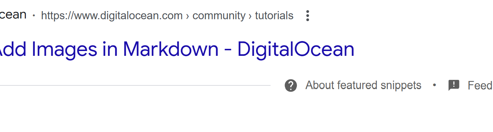

# **FP4 \- Final Project Writeup**

Feel free to refer to this [Markdown Cheat Sheet](https://www.markdownguide.org/cheat-sheet/) to make your writeup more organized, and you can preview your markdown file in VSCode [Markdown editing with Visual Studio Code](https://code.visualstudio.com/docs/languages/markdown#_markdown-preview). 

## Part 1: Website Description

Describe your website (300 words):

The website that I have decided to program is a blog website. I have many hobbies and interests, and I wanted a website that would allow me to express myself through my writing and findings. For example, I have a passion for cooking and baking and have a few American and Indian recipes that I would love to share online. I also love reading books, and want to post my book reviews online as well! Another great example is my deep dives into specific topics of Religion or Politics, including answering questions such as “What historical evidence supports the idea of God?”. All of this information would be included on this website through an individual blog post. 

There will be multiple pages on my website. On the home page, I will have a brief introduction of myself at the top, a breakdown of categories, and then my most recent blog posts. The breakdown of categories will allow users who are interested in a specific topic of my blog to be easily guided to those blog posts. For example, if someone is interested in my recipes, then they can click on the “My Recipe Book” category which will take them to all the blogs that I have posted regarding cooking and baking. Each category will be an icon on the home page and contain a label at the bottom. The target audience is anyone interested in learning about the topics that I have researched or provided information on, such as cooking or politics. 

This website will be interesting and engaging because I plan on using not only text but images and icons as well throughout the website and within the blog post. I also want the user to be able to comment and “heart” the blog post to gain reactions to my work. I believe this will make the website more interactive and attractive for users. 

On 0.5 pages (~300 words), summarize all the critiques you received during the lab session:

During the lab session, I got a lot of great feedback on all three of my designs. Regarding my portfolio and blog website, one girl recommended I consider how efficient it would be to add a new project to my portfolio or blog website through code. She stated that this may cause the process to be complicated, as I would have to go into the HTML of the website and manually change the code every time I wanted to update my website. This was great advice that I had not considered before. I also explained my interest in adding animations throughout my website, and she recommended the library P5. 

After one peer had brought up this challenge, another peer provided a possible solution. She had stated that instead of programming the website to be static, code it to be dynamic. She recommended I create it like the application Facebook or Instagram, where the user (myself) can view the running website, click on a category I want to write a blog in, click an “Add New Post” button, fill out the text box, and then click “Post!” to post the context to the website. This was a really amazing idea that I plan on implementing in my designs. 

One of my website ideas was building the 15-121 website. This past summer, I was a UI/UX designer for CMU (working under Professor Françeska) and redesigned the course website. As the programming of the website was postponed to next summer, I was open to the task as I had learned all the necessary skills in this class. However, I received many critiques for this idea. First, this website did not have much animation or complexity. It included 2 small animations, links linking to external sources, and links linking to PDF documents. When I explained this to my peers, many stated that this was too simple of a project to satisfy the project requirements. Additionally, they stated that the blog website I had explained to them was able to showcase more of my skills, ideas, and personality. 

Add 0.5 pages (~300 words) that digest the feedback you got in the lab. Indicate which critique you will act on in your next design and why you chose to incorporate/dismiss pieces of critique:

As stated previously, I got a lot of great feedback from this lab. I will definitely be incorporating many parts of the critique into my designs. For example, one of my peers explained that my blog post should be a dynamic site, not a state one. This was a great idea that I will be implementing in my design, as it will allow me to easily add or delete any blog posts. However, this opens up a new issue. If I allow the blog site to be dynamically changed by the user (me) viewing the website, then I need to make sure that viewers (who are NOT me) are not able to edit posts on the blog. My peers and I were also brainstorming methods to fix this issue, such as having a password-protected “Submit Post” which will only allow users who have the password (me) to post a blog post. 

One peer stated that, if I were to use animations, she recommended that I use the library P5. She stated that it is a very beginner-friendly library and has used it in her own experience. She stated that it is also an open-source library with many resources on the internet, which would help me as I have never used this library before. 

At the beginning of the work session, I was unsure which website design to go through with. However, towards the end, I decided to go with the Blog website. This is partly due to the critiques I received on my other two website designs. For example, on my 15-121 Course website design, I got feedback that the website was too simple for this assignment and did not showcase my true skills, passions, and personality. Thus, I decided not to go with this design. 

## Part 2: User Interaction

How a user would interact with your website? For each step, briefly but clearly state the interaction type & how we should reproduce it.

1. Interaction type. Click on X on page Y / scroll on page X, etc.  
2. 

## Part 3: External Tool

Describe what important external tool you used (JavaScript library, Web API, animations, or other). Following the bulleted list format below, reply to each of the prompts.

1. Name of tool1  
   * Why did you choose to use it over other alternatives? (2 sentences max)  
   * How you used it? (2 sentences max)  
   * What does it add to your website? (2 sentences max)  
2. Name of tool2

## Part 4: Design Iteration

Describe how you iterated on your prototypes, if at all, including any changes you made to your original design while you were implementing your website and the rationale for the changes. (4-8 sentences max)

## Part 5: Implementation Challenge

What challenges did you experience in implementing your website? (2-4 sentences max)

## Part 6: Generative AI Use and Reflection

Describe how you used Generative AI tools to create this final project (fill in the following information, write \~500 words in total).

Document your use of all GenAI tools — ChatGPT, Copilot, Claude, Cursor, etc. using the template below. Add/Delete rows or bullet points if needed, and replace Tool1/Tool2 with the name of the tool.

### Usage Experiences by Project Aspects

Feel free to edit the column \_ (other?) or add more columns if there's any other aspect in your project you've used the GenAI tools for.

For the following aspects of your project, edit the corresponding table cell to answer:
- *Usage*: Whether you used / did not use this tool for the aspect. Enter [Yes/No]
- *Productivity*: Give a rating on whether this tool makes your productivity for X aspect [1-Much Reduced, 2-Reduced, 3-Slightly Reduced, 4-Not Reduced nor Improved, 5-Slightly Improved, 6-Improved, 7-Much Improved].

| Tool Name | Ratings | design | plan | write code | debug | \_ (other?) |
| :---- | :---- | :---- | :---- | :---- | :---- | :---- |
| Tool1 | Usage | Yes/No | Yes/No | Yes/No | Yes/No | Yes/No |
| Tool1 | Productivity | 1~7 | 1~7 | 1~7 | 1~7 | 1~7 |
| Tool2| Usage | Yes/No | Yes/No | Yes/No | Yes/No | Yes/No |
| Tool2 | Productivity | 1~7 | 1~7 | 1~7 | 1~7 | 1~7 |

### Usage Reflection

> Impact on your design and plan 
* It matched my expectations and plan in [FP2](#generative-ai-use-plan) in that … For example, 
  1. Tool1: 
  2. Tool2:
* It did not match my expectations and plan in [FP2](#generative-ai-use-plan) in that … For example, 
  1. Tool1: 
  2. Tool2:
* GenAI tool did/did not influence my final design and implementation plan because … For example, 
  1. Tool1: 
  2. Tool2:

> Use patterns
* I accepted the generations when …  For example, 
  1. Tool1: this tool once suggested … and I adjusted my design according to the suggestion because … 
  2. Tool2: 
* I critiqued/evaluated the generated suggestions by … For example, 
  1. Tool1: this tool once suggested … but I modified/rejected the suggestion because … 
  2. Tool2: 

> Pros and cons of using GenAI tools
* Pros
  1. Tool1: 
  2. Tool2:
* Cons
  1. Tool1: 
  2. Tool2:

### Usage Log

Document the usage logs (prompts and chat history links) for the GenAI tools you used. Some tools may not have an easy way to share usage logs, just try your best! Some instructions for different tools:

1. [ChatGPT](https://help.openai.com/en/articles/7925741-chatgpt-shared-links-faq) / [Gemini](https://support.google.com/gemini/answer/13743730?hl=en&co=GENIE.Platform%3DDesktop): share the anonymous link to all of your chat histories relevant to this project
2. [GitHub Copilot (VSCode)](https://code.visualstudio.com/docs/copilot/copilot-chat#:~:text=You%20can%20export%20all%20prompts%20and%20responses%20for%20a%20chat%20session%20in%20a%20JSON%20file%20with%20the%20Chat%3A%20Export%20Session...%20command%20(workbench.action.chat.export)%20in%20the%20Command%20Palette.): export chat histories relevant to this project.

---

# **FP3 \- Final Project Check-in**

Document the changes and progress of your project. How have you followed or changed your implementation & GenAI use plan and why? Remember to commit your code to save your progress.

## Implementation Plan Updates

- [ ] ...

## Generative AI Use Plan Updates

- [ ] ...

Remember to keep track of your prompts and usage for [FP4 writeup](#part-6-generative-ai-use-and-reflection).

---

# **FP2 \- Evaluation of the Final project**

## Project Description

Briefly restate your motivation and a short description of your project.

## High-Fi Prototypes

### *Prototype 1*

A brief description and summary of the user feedback (\<100 words, 2 images) 

### *Prototype 2*

…

## Usability Test

Discuss the user feedback you got during the evaluation / usability test (\~300 words). Indicate which feedback you implemented, inspired new directions, or otherwise influenced your final design. 

## Updated Designs

Show screenshots of your updated design based on the user feedback (\<100 words, \~2 images).

## Feedback Summary

Summarize the feedback you received in the lab session and discuss how it influenced your design (\~300 words). 

## Milestones

Outline weekly milestones to plan your expected implementation progress until the end of the semester (\~300 words). 

### *Implementation Plan*

- [ ] Week 9 Oct 28 \- Nov 1:
  - [X] FP1 due
  - [ ] ...
  
- [ ] Week 10 Nov 4 \- Nov 8:   
  - [ ] FP2 due

- [ ] Week 11 Nov 11 \- Nov 15:  
- [ ] Week 12 Nov 18 \- Nov 22:   
- [ ] Week 13 Nov 25 \- Nov 29:  

  - [ ] Thanksgiving  
- [ ] Week 14 Dec 2 \- Dec 6:  
  - [ ] FP4 due 

### *Libraries and Other Components*

List the JS libraries and other components (if applicable) that you plan to use. 
* 

## Generative AI Use Plan

Outline how you plan to use Generative AI tools to aid in the implementation (\~300 words).

### *Tool Use*

 What would you use? Edit the list given your plan. For each tool, explain briefly on what do you expect Generative AI to help you with and what might it not be able to help you with.

* ChatGPT  
  * I will use it for … because it can help me …  
  * I will not use it for … because it might not be able to help me with …   
* GitHub Copilot  
* ...

### *Responsible Use*

How would you use Generative AI responsibly? 

---

# **FP1 \- Proposal for Critique**

## Idea Sketches

### *Idea 1*

Add a few sentences about your design. Briefly state the motivation of each project idea. Example questions to answer:

* What is the basic idea of your final project? (1-2 sentences)  
* How do you plan to make your design interactive and engaging?  
* How do you plan to make your design accessible?  
* What information do you specifically want to convey and include on your website?

### *Idea 2*

…

### *Idea 3*

…

## Feedback Summary

Summarize all the critiques you received during the lab session (\~300 words). 

## Feedback Digestion

Digest the feedback you got in the lab (\~300 words). Indicate which critique you will act on in your next design and why you chose to incorporate/dismiss pieces of critique.
