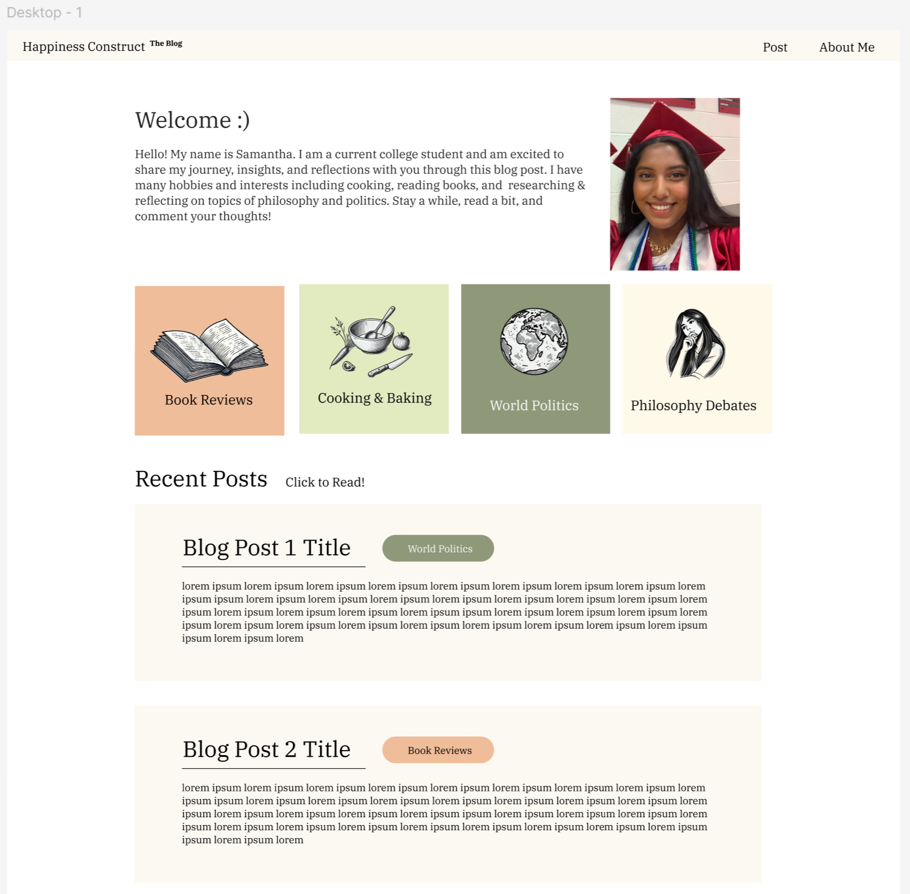
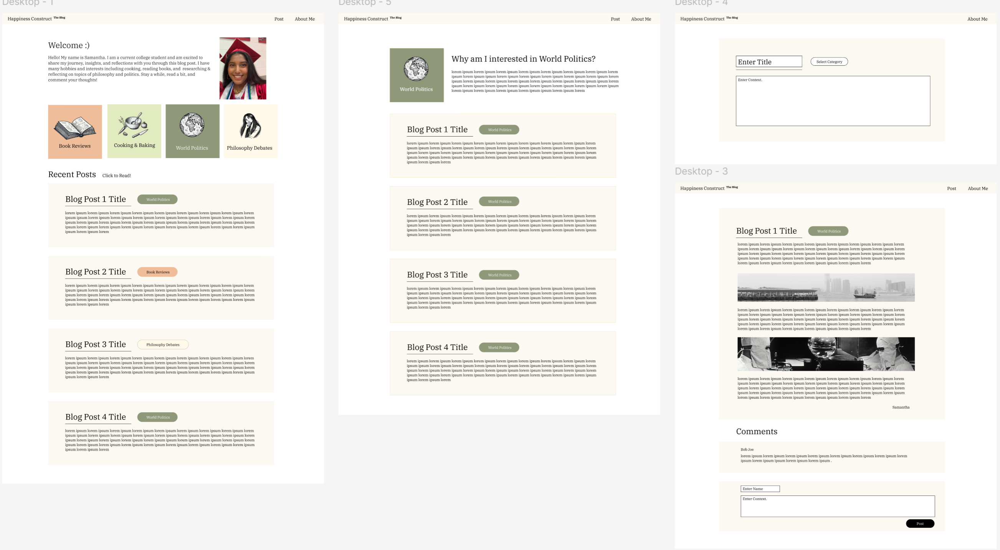
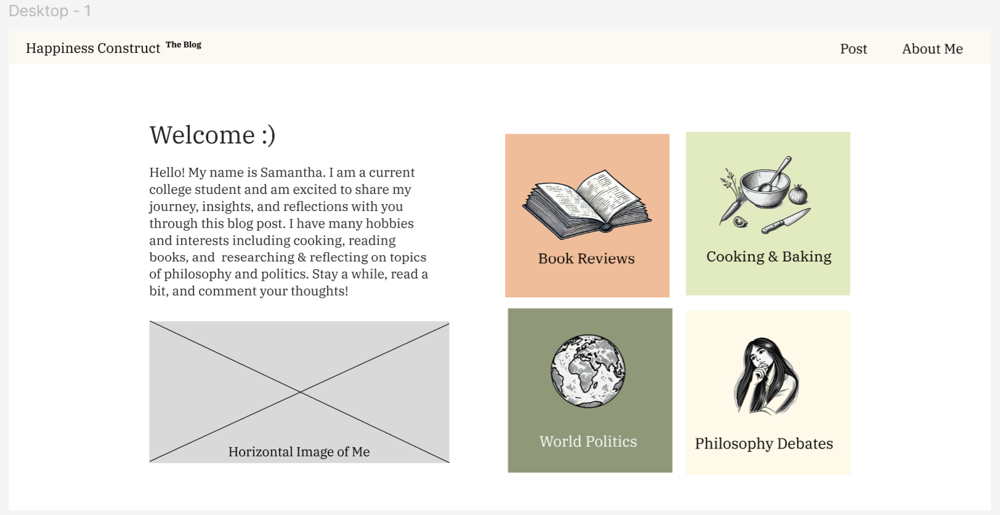
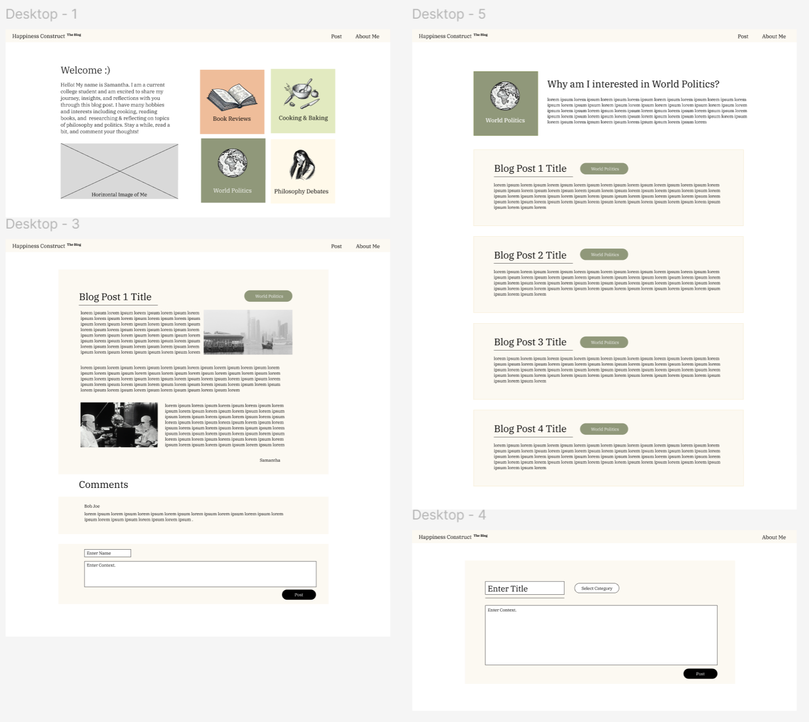
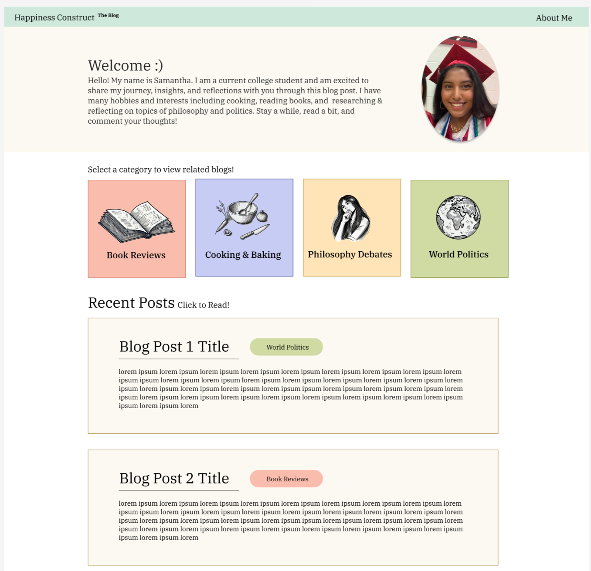
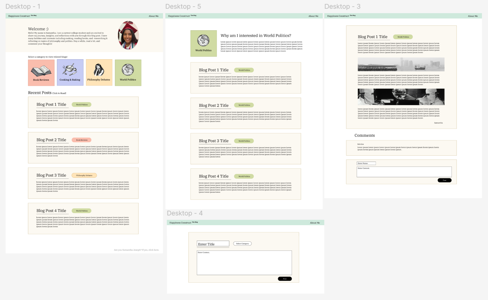
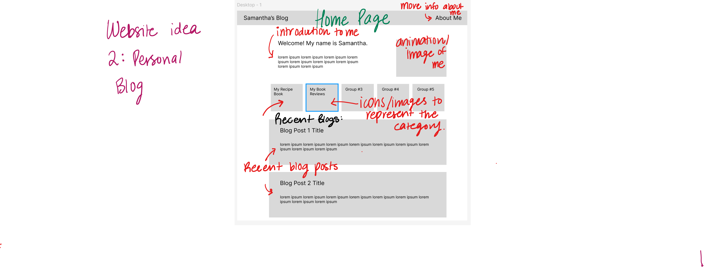
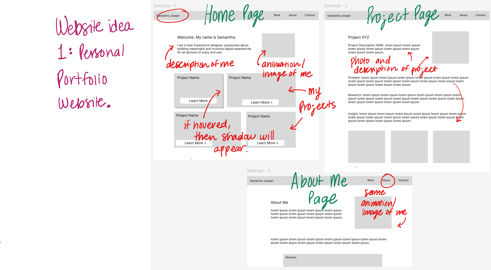
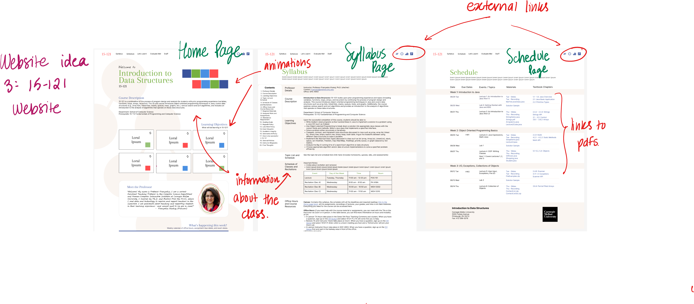

# **FP4 \- Final Project Writeup**

Feel free to refer to this [Markdown Cheat Sheet](https://www.markdownguide.org/cheat-sheet/) to make your writeup more organized, and you can preview your markdown file in VSCode [Markdown editing with Visual Studio Code](https://code.visualstudio.com/docs/languages/markdown#_markdown-preview). 

## Part 0: ADDITIONAL information
I have created an Appendix at the bottom of FP4 to include the WAVE screenshots. 
Screens to test on: Any Desktop / Mac frame will work. Additionally, Ipad size will also work. 

## Part 1: Website Description
Describe your website (300 words). 

My website is a blog post about books. The purpose of this blog post is to post my opinions/reviews about a book and begin conversations with others. I can input information like the book title, its genre, my review, the book image, etc. and it will be posted on the website. I can delete a post too. Viewers who click on an individual post can then comment their thoughts. The target audience is interested readers who (1) want to learn more about a specific book, (2)  are looking for their next read, or (3) are looking to start a conversation regarding a specific book. 

There is much information conveyed on my website. On the home page, I have a short introduction about myself. In text and a bar graph, I provide an overview of how many books I have read and reviewed, ordered by topic. If posts are present, they will appear in beige boxes. Each post on the home page contains the book title, its genre, a summary, and the book image. Once you click on an individual post, it takes you to a page with the full review of the book. If you click on the “About Me” in the top right corner, you can read a deeper introduction of myself. 

My website is interesting and engaging in multiple ways. It is dynamic, If a user comments on a post or if I upload a book review, these changes are seen immediately. I also made sure to color-code all the topics to bring a pop of color and help users identify posts that they are interested in. I also included a graph on the homepage so users can easily see if their preferred genre is included in my blog post. 

## Part 2: User Interaction
How a user would interact with your website? For each step, briefly but clearly state the interaction type & how we should reproduce it.

From the Home Page, there are multiple actions you can take. We will go through the main actions here. NOTE: To get to the home page, click the words “Happiness Construct” on the top left of the screen. 
1. Add a post to the blog
a. You are on the home page. Scroll down to the link at the bottom, which states, “Are you Samantha? If yes, click here!”. Click on this link. 
b. You are now on the “Post-Maker” page. Input all necessary information such as the Title, Genre, Summary, Body, Image URL, and Image Alternate Text. You can input any text in the Title, Summary, Body, and Image Alternate Text fields, such as “Test1” or “Example1”. For the Genre, choose from the dropdown.  However, make sure that for the Image URL, you choose from one of the following URLs: 
(../assets/finalProjectAssets/sixofcrowsPicture.jpg)
(../assets/finalProjectAssets/agoodgirlsguidetomurderPicture.png)
(../assets/finalProjectAssets/bythebookPicture.png)
(../assets/finalProjectAssets/illuminaePicture.png)
(../assets/finalProjectAssets/luckofthetitanicPicture.png)
(../assets/finalProjectAssets/oneofusislyingPicture.png)
(../assets/finalProjectAssets/hollyPicture.png)
(../assets/finalProjectAssets/thegreatgatsbyPicture.png)

I have written a few example posts and included their inputs in the document linked below. If you would like to take any text from here, please feel free to do so. This may save some time on your end. Link to document: https://docs.google.com/document/d/1GJwki4DMki1D_mag58ftKIUjO8Ik0lVvPZ_K3xpoiu8/edit?usp=sharing
c. Scroll to the bottom of the page. Click “Post!”
d. You will then be navigated to the Home page. Scroll to the bottom. You will see a new blog post including the new information you just input. 

2. Review a blog post and comment. 
a. You are on the home page. Scroll to the bottom of the page. 
b. Choose any individual post. Click on this post. 
c. You will be directed to that post’s specific page. You are now able to view the full review and details of that book.
d. Scroll to the bottom of the page. You will see a box that states “Add Comment here”. 
e. Click on this box. Type a comment. This can be any text, such as “Example1” or “Test1”. Then click the button “Post Comment!”.
f. You will see that your comment has been posted right below the review/details of the book. 

3. View the bar graph on the Home page.
a. You are on the home page. Scroll down till you see the subtitle “What have I read and reviewed so far?”. 
b. Review the information below this subtitle. You will see that the information beneath the subtitle, both in the text and graph, has changed after a post is uploaded (or deleted). This is dynamic. If you add five more book posts, this will also change.

4. Delete a post from the blog.
a. You are on the home page. Scroll to the bottom of the page. 
b. Choose any individual post. Click on this post. 
c. You will be directed to that post’s specific page. You are now able to view the full review and details of that book.
d. Scroll to the bottom of the page. You will see a button that states “Delete Post!”. 
e. Click on this button. You will be taken back to the home page. 
f. Scroll to the bottom of the home page. You will see that the post has been deleted. 

5. Read the “About Me” page 
a. You are on the home page. Look to the top right of the screen. 
b. You will see text that states “About Me”. Click on this text. 
c. This will take you to the “About Me” page. 

## Part 3: External Tool

Describe what important external tool you used (JavaScript library, Web API, animations, or other). Following the bulleted list format below, reply to each of the prompts.

1. D3.js
   * I chose D3.js because it was very beginner-friendly and contained many tutorials on YouTube to watch. The professor had recommended this in his data visualization lecture, and I did more research into the library and saw that it was able to complete the task I wanted.  
   * How you used it? (2 sentences max)  
I used this library to visualize how many book posts there are of each genre. So if there are no posts of romance books, the bar will be at 0, while if there are five fantasy books, the bar will be taller at 5. 
   * What does it add to your website? (2 sentences max)  
This adds a great visualization element to my blog post because it helps users determine if what they are looking for is present on the website. For example, if they only want to read Science Fiction, but see that the number of posts is 0 through the graph, then they will leave the blog.
2. localStorage
   * I chose this because I had a small amount of data needing to be stored. We also used localStorage in our homeworks, so I was familiar with using this API.  
   * How you used it? (2 sentences max)  
I used localStorage to hold data regarding all the blog posts. Each blog post was an instance of an object, and each blog post contained data such as the title, genre, summary, body message, comments, image, and image alternate text. 
   * What does it add to your website? (2 sentences max)  
With this, I can efficiently store, retrieve, visualize, and delete this post information with the click of a button. 

## Part 4: Design Iteration

Many changes and iterations have been done. To use more libraries, I had to learn how to use the D3.js library and input my already existing data into this action. Another great change was regarding how I was storing my data. Previously, I stored a variable called LocalStorage1 (an array) and another variable called LocalStorage2 (an object). One was used for displaying the post information on the home page, while the other was used for displaying the post information on the specific post page. However, this was redundant, as much information overlapped the two data structures. Thus, I decided to combine the two into LocalStorage one (an object) and only reference this, which made my code cleaner and more efficient. 

## Part 5: Implementation Challenge
What challenges did you experience in implementing your website? (2-4 sentences max)

One challenge I faced was using the D3.js library. I have not used this in the past and have not learned this in class. Thus, I watched multiple tutorials (such as this one: https://www.youtube.com/watch?v=C4t6qfHZ6Tw) to help me understand how to use this tool. 

## Part 6: Generative AI Use and Reflection

Describe how you used Generative AI tools to create this final project (fill in the following information, write \~500 words in total).

I only used ChatGPT for this assignment. I used it to learn about the specific tools of the D3.js library, such as creating bargraphs. I didn't input my code or data into ChatGPT and ask it to code a specific feature. That, I would input examples which I found online (through tutorials or youtube) and ask ChatGPT to explain each part of it. I would then ask if I implemented some change, such as different type of inputed data structure, then how would this change the current code? It was a great learning experience and I learned much about how to use the SVG/bar-chart feature of D3.js. It was really helpful in explaining small concepts such as "what does this term mean?" to "if we changed this key aspect, what would happen?". 

### Usage Experiences by Project Aspects
Feel free to edit the column \_ (other?) or add more columns if there's any other aspect in your project you've used the GenAI tools for.

| Tool Name | Ratings | design | plan | write code | debug | \_ (other?) |
| :---- | :---- | :---- | :---- | :---- | :---- | :---- |
| ChatGPT | Usage | No | Yes | No | No | No |
| Tool1 | Productivity | 1 | 7 | 1 | 1 | 1 |

### Usage Reflection

> Impact on your design and plan 
* It matched my expectations and plan in [FP2](#generative-ai-use-plan) in that it helped me learn how to use the D3.js tools. For example, 
  1. ChatGPT: I was able to ask questions such as "How do you input data into a bar chart", and it was able to provide me with a great example and explanation. 
* It did not match my expectations and plan in [FP2](#generative-ai-use-plan). For example, 
Not Applicable.
* GenAI tool did influence my final design and implementation plan because it helped me realize how I can present my data for the users. For example, 
  1. ChatGPT: I learned that I can display the different counts of a certain genre for users to see. I also learned that this can be dynamically changed if a post is deleted or added. 

> Use patterns
* I accepted the generations when they seemed to be sufficient. For example, 
  1. ChatGPT: I asked ChatGPT about general topics and techniques. Once I read through and understood the concepts, then I was able to edit it depending on my data and preferences. 
* I critiqued/evaluated the generated suggestions by reviewing them and prompting another question if it was unclear. For example, 
  1. ChatGPT: If its response was unclear or did not take into consideration a certain aspect of my question, I would ask the question again and voice my modification.

> Pros and cons of using GenAI tools
* Pros
  1. ChatGPT: Great tool for learning. It taught me much about the D3.js library and how to create bar charts. I was able to ask specific questions regarding the code it provided, and it provided great explanations. 
* Cons
  1. ChatGPT: It can be confusing to understand, sometimes. It may use complex language or propertiies which I am unfamiliar with. However, I make sure in the next prompt to ask it to use similar language and explain any unfamiliar areas of the code. 

### Usage Log

Document the usage logs (prompts and chat history links) for the GenAI tools you used. Some tools may not have an easy way to share usage logs, just try your best! Some instructions for different tools:

Link: https://chatgpt.com/share/67574ce6-5734-8007-91a1-212effe2e612

### Appendix
There were multiple, large screenshots to be included here. I compliled them on a google doc: https://docs.google.com/document/d/1ZZRyaNikXMD3FCHl3Dbn8R4X0nasA9cNsBwErVsz3Hw/edit?usp=sharing

---

# **FP3 \- Final Project Check-in**

Document the changes and progress of your project. How have you followed or changed your implementation & GenAI use plan and why? Remember to commit your code to save your progress.

## Implementation Plan Updates
- Much changed regarding my plan for my website. I previously was going to implement a backend database for long-term storage. However, I later switched to using a D3.js library for another feature (data visualization). This is because there were more resources avaiable regarding D3.js than using Firebase (the backend database I was planning on using).

## Generative AI Use Plan Updates
- Nothing changed regarding my use of GenAI. 

Remember to keep track of your prompts and usage for [FP4 writeup](#part-6-generative-ai-use-and-reflection).

---

# **FP2 \- Evaluation of the Final project**

## Project Description

My project is a blog website. On the website, I will be able to post blogs based on different interests and passions, such as cooking or book reviews. My website will have multiple pages. On the home page, there will be a personal introduction, a section explaining the different topics or categories that I write about, and my recent posts. Once a user clicks a specific category or topic, it will direct them to the second page, which will show all blog posts relating to that topic. There is also an about me page, where the user can learn more about me. There is a post page that will only be accessible to me, which is where I can write my posts. Lastly, there will be individual blog post pages, showcasing the content. 

## High-Fi Prototypes
Question from Google Doc: Add screenshots of your 2 high-fi prototypes and add a brief summary of the user feedback for each. Use about max. 1 page (<100 words, ~2 images) per prototype.
### *Prototype 1*

I received a lot of great feedback. Users stated that they could easily understand what the website was about and navigate through it. They understood, additionally, the different topics that I would blog about and how they could access those specific posts. One user noted that he liked the “tags” that were on each of the posts, because it  informed him on which posts fall within which category. The users, however, were confused about why there was a “Post” button and believed that they could post on this blog if they clicked that button. However, this was intended for my use. 

### *Prototype 2*
I also received a lot of great feedback on this prototype. I changed the layout of the topic categories, stacking them on top of each other. The users stated they preferred them lined up (as on my previous prototype), as the current design appeared more cluttered. I also removed the recent posts from the home page in this prototype. However, users stated that having the recent posts available may interest users as soon as they enter the home page. Lastly, users noted that images could fall on the left and right of blog text, which made it look more interactive. They both preferred this structure to the structure of the previous design. 

## Usability Test

Discuss the user feedback you got during the evaluation / usability test (\~300 words). Indicate which feedback you implemented, inspired new directions, or otherwise influenced your final design. 

The specific user feedback that I had received through my user testing was discussed in my previous answer. I implemented much of the feedback into my final design. First, I made sure to remove the “Post” button located on the Home page. Previously, this confused users, as they believed they could click on this button and post their blog on my website. I decided to remove this button and create another smaller button on the home page instead labeled “Are you Samantha Joseph? If yes, click here”. This would be at the bottom of the page and will be password-protected, which would direct me to the post-creation page. 

I also learned that the users preferred the different categories on the home page lined up horizontally rather than on top of each other. They saw this as more cluttered and less intuitive. Thus, I made sure to line up the categories horizontally in the final design. I also made sure to include the “Most Recent Posts” on the home page, as users stated that this could attract viewers as soon as they loaded the page. Regarding the actual blog post page, users also stated that they prefer having a layout where the images and/or videos were scattered on the left and right side of the page, over having the images and/or videos sandwiched between chunks of text. The users stated the first structure is more user-friendly, intuitive, and easier to follow with the eyes. Thus, I made sure to incorporate this change into the final design as well. 

## Updated Designs

Show screenshots of your updated design based on the user feedback (\<100 words, \~2 images).

As you can see in these screenshots, I made sure to remove the “Post” button from the top screen and added another button at the bottom of the screen for me to use. I made sure to include the “Most Recent Posts” section on the home page and lined up the different topic categories horizontally. On the blog post page, I made sure that images could be seen on both the left and right sides of the design, not just sandwiched between text. I also played around with different color palettes and decided to change the color theme of my website. 

Link to prototype: https://www.figma.com/proto/iQuzeXhoSWvnLtN3WyGWv3/FinalOne?node-id=1-2&node-type=frame&t=hP5LqMFDaZtu99qW-1&scaling=min-zoom&content-scaling=fixed&page-id=0%3A1

## Feedback Summary

Summarize the feedback you received in the lab session and discuss how it influenced your design (\~300 words). 

During the lab session, I got a lot of great feedback as well. One peer stated that while looking at my home page, users may be confused about what to do regarding the topic categories. She stated, “Users will see these categories, but how will they know to click them? How will they know the action which will be carried out if they do click one of these categories?” This was a valid point, and I am glad she gave this feedback. The four categories that I have show topics I am interested in, but users don’t know that if they click a category, they will be directed to blog posts relating to that category. Thus, I added a header stating “Select a category to view related blogs!”. That way, users know what will occur when they click a category. Users also appreciated the drawings and labels of each category, stating that they were eye-catching and helped convey the meaning of what each topic was about. 
Another peer stated that the color beige I used through the website may be hard to see for certain people, as it is very similar to the background page color of white. I appreciate this feedback as well, as this was an issue that I had not previously seen. The beige could be hard to differentiate from the background, especially for those who are visually impaired. Thus, to combat this, I decided to implement a dark, golden border around each beige shape I used to help users see the different sections. Lastly, users stated that my layout was clean and easy to navigate. They understood how to complete certain tasks such as reading a specific blog or commenting on a blog. 

## Milestones

Outline weekly milestones to plan your expected implementation progress until the end of the semester (\~300 words). 

I have split my plan into 4 weeks below. 
Week 10 - During this week, I want to create a general layout. I want to create, using HTML, CSS, and JS, all of the individual pages. They will all be static, however, at this point. I also need to make sure that certain features and elements are able to be shown in a single post, such as images and videos. During this week, I will create a class that will then create post objects. This process will be similar to the notecard example we did in recitation.
Week 11 - During this week, I will do the hardest step of the project. I want to create a long-term data storage component of the website which will store my posts. Thus, short-term storage which we learned in class will not be sufficient. I would need to use bank-end components to handle the data storage and real-time updates. Through my research, I learned that popular databases include Firebase and MongoDB (with Node.js). These tools will be used to store and fetch data. Regarding providing real-time updates, I can also use Firebase or the application WebSockets with a library like Socket.io to put updates to the website.  There are many other popular tools that can be used for this part of my project, and I will continue to do research on the specifics of these. But for now, I am planning on using Firebase, as it seems to be a more simple, user-friendly application with minimal setup. 
Week 12 - During this week, I want to implement another important feature on the website. As I want myself to only be able to write and submit blog posts onto the website, I need to have some sort of authentication process. According to my research, I will be able to do this by creating a backend, implementing a login route on the server that verifies the user’s password, and if the correct password is entered, then a token must be sent to indicate that the user is authenticated, and the user will be able to post content. Firebase also has a similar feature which I will be able to use if I decide to go with that tool.

### *Implementation Plan*

- [ ] Week 9 Oct 28 \- Nov 1:
  - [X] FP1 due
  
- [ ] Week 10 Nov 4 \- Nov 8:   
  - [X] FP2 due
  - [ ] Create a static version of the website

- [ ] Week 11 Nov 11 \- Nov 15: Create a long-term data storage component
- [ ] Week 12 Nov 18 \- Nov 22: Implement authentication process
- [ ] Week 13 Nov 25 \- Nov 29: Finishing touches and details

  - [ ] Thanksgiving  
- [ ] Week 14 Dec 2 \- Dec 6:  N/A - Making sure website runs smoothly
  - [ ] FP4 due 

### *Libraries and Other Components*

For my back-end creation, either Firebase or MongoDB (with Node.js)
For user-authentication, I can also use Firebase or the application WebSockets with a library such as Socket.io.

## Generative AI Use Plan

I plan on using Generative AI tools such as ChatGPT to help understand how to use certain tools. For example, I have never used Firebase before and need to learn how to use this tool to set up the backend database and authentication system. Thus, I would want to use ChatGPT to teach me the general features of the programming and learn how to connect my back end to my front end as well. I will make sure to use Generative AI responsibly by understanding the information it provides me before applying it to my project responsibly. Thus, I will learn from this experience and be able to apply these tools to other projects. Something that ChatGPT may not be helpful with is programming the specific pages and applications such as the frontend,  backend database, and authentication system portions of my website.  All of these parts are going to be connected and complex, using different tools and systems. I believe that this may be too complex for Generative AI to be programmed, and thus, will not use it for that. I am planning on using Generative AI more to learn how to use these tools and see examples, but then I plan on applying them to my code by myself without assistance. 

### *Tool Use*

I would use it to learn how certain tools look, how they are used, and in what contents they are used in. However, I won't give AI my issue and then copy the code from it, because I will not learn from this process and it probably won't be able to understand the complexity of the project. I will learn how to apply these tools to my application through the information and examples Generative AI provides, but then I will have to think through how I use this in my own website. 

### *Responsible Use*

I will use it responsibly by not copying any code from it and only learning general topics/applications. 

---

# **FP1 \- Proposal for Critique**

## Idea Sketches

### *Personal Blog * - What I have decided on doing. 

Describe your website (300 words):
The website that I have decided to program is a blog website. I have many hobbies and interests, and I wanted a website that would allow me to express myself through my writing and findings. For example, I have a passion for cooking and baking and have a few American and Indian recipes that I would love to share online. I also love reading books, and want to post my book reviews online as well! Another great example is my deep dives into specific topics of Religion or Politics, including answering questions such as “What historical evidence supports the idea of God?”. All of this information would be included on this website through individual blog posts. 

There will be multiple pages on my website. On the home page, I will have a brief introduction of myself at the top, a breakdown of categories, and then my most recent blog posts. The breakdown of categories will allow users who are interested in a specific topic of my blog to be easily guided to those blog posts. For example, if someone is interested in my recipes, then they can click on the “My Recipe Book” category which will take them to all the blogs that I have posted regarding cooking and baking. Each category will be an icon on the home page and contain a label at the bottom. The target audience is anyone interested in learning about the topics that I have researched or provided information on, such as cooking or politics. 

This website will be interesting and engaging because I plan on using not only text but images and icons as well throughout the website and within the blog post. I also want the user to be able to comment and “heart” the blog post to gain reactions to my work. I believe this will make the website more interactive and attractive for users. 

### *Personal Portfolio Website*

Idea of creating a personal portfolio where I can portray my previous UX design projects and introduce myself. I planned on making this engaging by including exciting colors and animations. I would make sure it is accessible by making sure that the HTML is organized properly with correct headers, to make sure that screen readers can interpret them, and also make sure my theme and colors are accessible for the visually impaired. I want to include information about me, my resume information, and work/projects. My work and projects will go through the entire process of the application I created, including research, insights, testing, prototypes, etc.

### *15-121 Website Idea*

This past summer, I was a UI/UX design intern and redesigned CMU's 15-121 website. I have created the figma prototype, and was planning on beginning the coding process of this project. I planned on making this engaging by including exciting colors and animations. I would make sure it is accessible by making sure that the HTML is organized properly with correct headers, to make sure that screen readers can interpret them, and also make sure my theme and colors are accessible for the visually impaired. I want to include information about the course, professor, and resources available. There would have been a ton of information on this website, from assignments, to recordings, to the syllabus.

## Feedback Summary

Summarize all the critiques you received during the lab session (\~300 words).

During the lab session, I got a lot of great feedback on all three of my designs. Regarding my portfolio and blog website, one girl recommended I consider how efficient it would be to add a new project to my portfolio or blog website through code. She stated that this may cause the process to be complicated, as I would have to go into the HTML of the website and manually change the code every time I wanted to update my website. This was great advice that I had not considered before. I also explained my interest in adding animations throughout my website, and she recommended the library P5. 

After one peer had brought up the challenge of manually editing my website every time I wanted to update it, another peer provided a possible solution. She had stated that instead of programming the website to be static, code it to be dynamic. She recommended I create it like the application Facebook or Instagram, where the user (myself) can view the running website, click on a category I want to write a blog in, click an “Add New Post” button, fill out the text box, and then click “Post!” to post the context to the website. This was a really amazing idea that I plan on implementing in my designs. 

One of my website ideas was building the 15-121 website. This past summer, I was a UI/UX designer for CMU (working under Professor Françeska) and redesigned the course website. As the programming of the website was postponed to next summer, I was open to the task as I had learned all the necessary skills in this class. However, I received many critiques for this idea. First, this website did not have much animation or complexity. It included 2 small animations, links linking to external sources, and links linking to PDF documents. When I explained this to my peers, many stated that this was too simple of a project to satisfy the project requirements. Additionally, they stated that the blog website I had explained to them was able to showcase more of my skills, ideas, and personality. 

## Feedback Digestion

Digest the feedback you got in the lab (\~300 words). Indicate which critique you will act on in your next design and why you chose to incorporate/dismiss pieces of critique.

As stated previously, I got a lot of great feedback from this lab. I will definitely be incorporating many parts of the critique into my designs. For example, one of my peers explained that my blog post should be a dynamic site, not a state one. This was a great idea that I will be implementing in my design, as it will allow me to easily add or delete any blog posts. However, this opens up a new issue. If I allow the blog site to be dynamically changed by the user (me) viewing the website, then I need to make sure that viewers (who are NOT me) are not able to edit posts on the blog. My peers and I were also brainstorming methods to fix this issue, such as having a password-protected “Submit Post” which will only allow users who have the password (me) to post a blog post. 

One peer stated that, if I were to use animations, she recommended that I use the library P5. She stated that it is a very beginner-friendly library and has used it in her own experience. She stated that it is also an open-source library with many resources on the internet, which would help me as I have never used this library before. 

At the beginning of the work session, I was unsure which website design to go through with. However, towards the end, I decided to go with the Blog website. This is partly due to the critiques I received on my other two website designs. For example, on my 15-121 Course website design, I got feedback that the website was too simple for this assignment and did not showcase my true skills, passions, and personality. Thus, I decided not to go with this design. 

